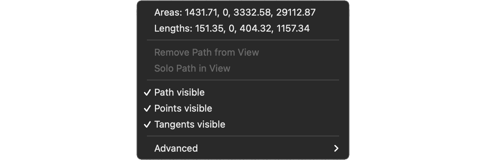

# Context menu

The context menu is accessed by right-clicking anywhere in the canvas and contains the following:

* Numerical data showing the **area and length** of selected paths.
* The option to **Remove Path from View**. This will remove all selected paths from the canvas. You can also remove selected paths with the Backspace (delete) key on your keyboard, when the [Paths tab](path-tab.md) is active.
* The option to **Solo Path in View**. This will remove all non-selected paths from the canvas.
* Options to **toggle the visibility** of paths, points and tangents. Sometimes, paths can be so complex that you need to temporarily turn off the visibility of tangents, for example.
* Options to **export path data** into one of two formats. The AE format is written as data that can be used in After Effects scripts or expressions.

