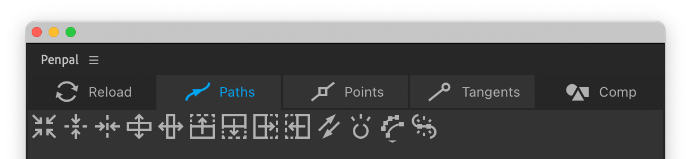

# Paths tab

The functions in the Paths tab tend to affect the shape as a whole, rather than it’s individual points. Most of these functions can’t be accurately performed with After Effects’ native toolset.


When we refer to a path’s **bounding box** we mean the rectangle formed by it’s outermost parts - which can be seen in After Effects if you select a path property and then tap Cmd/Ctrl + T to enable Free Transform mode.


####  Center

This will move the path as a whole shape, so that it is centered around the composition, layer or shape group’s origin, depending on which Space you have active.&#x20;

####  Center vertically

This will move the path up or down as a whole shape, so that it is centered vertically around the composition, layer or shape group’s origin, depending on which Space you have active.

####  Center horizontally

This will move the path left or right as a whole shape, so that it is centered horizontally around the composition, layer or shape group’s origin, depending on which Space you have active.

####  Flip vertically

This button will flip the selected path as a whole shape, top-to-bottom, around it’s center. The bounding box of the path will remain the same.

####  Flip horizontally

This button will flip the selected path as a whole shape, left-to-right, around it’s center. The bounding box of the path will remain the same.

####  Flip up

This button will flip the selected path as a whole shape, around the top edge of it’s bounding box.

####  Flip down

This button will flip the selected path as a whole shape, around the bottom edge of it’s bounding box.

####  Flip right

This button will flip the selected path as a whole shape, around the right edge of it’s bounding box.

####  Flip left

This button will flip the selected path as a whole shape, around it’s left edge of it’s bounding box.

####  Reverse

This button will reverse the order of the points and tangents for the selected path, such that it’s first vertex remains the same, but it’s direction runs the other way. Unless you use it on an open path, in which case the First Vertex will, naturally, be at the opposite end.&#x20;

####  Toggle open

This button will toggle selected paths from open to closed or vice versa, depending on their current state. If you have multiple paths selected, you can hold `Alt` to ensure they are all open, or `Cmd/Ctrl` to ensure they are all closed.

#### Simplify

This function removes points from the selected paths whilst attempting to preserve their basic shape. When you hover over the button, it brings up a slider below. Drag the slider to the right to reduce the number of points. Penpal's canvas displays a preview of how your paths will be simplified, and the original path as a dark line for comparison. To apply the simplification to your layers, click the blue checkmark icon. If you move your cursor away from the slider at any time, the simplify process is aborted.

#### Join

This button will join two or more open paths into one. Paths are joined in the order they were selected in the canvas, and from each one's last point to the next one's first point (following their directional arrows). A new, joined path is created next to the first one, and that original path has it's visibility disabled. If your paths seem to join at the wrong ends you probably need to [reverse](path-tab.md#reverse) one or more of them before you join them.


The Join function currently does not support masks, it only works with shape paths. This is due to differences in the way After Effects handles shapes and masks.


