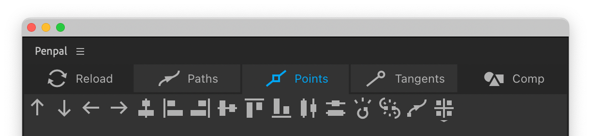

# Points tab

The first eight functions in the points tab all move points into a line, and correspond to typical Adobe **align and distribute** panels found in Creative Cloud applications.


Bear in mind that move, align, distribute and snap functions will behave parallel to the X and Y axes of whichever Space is active - composition, layer or shapes' parent group.


#### Move up, Move down, Move left, Move right

These buttons move selected points by 1px, or 10px if you hold `Shift`

####  Align horizontal

This button will move all selected points into a line at their horizontal center.

####  Align left

This button will move all selected points into a vertical line at the leftmost point.

####  Align right

This button will move all selected points into a vertical line at the rightmost point.

####  Align vertical

This button will move all selected points into a line at their vertical center.

####  Align top

This button will move all selected points into a horizontal line at the topmost point.

####  Align bottom

This button will move all selected points into a horizontal line at the bottommost point.

####  Distribute horizontally

This will distribute the selected points at even spaces between the leftmost and rightmost points. Requires at least three points to be selected.

####  Distribute vertically

This will distribute the selected points at even spaces between the topmost and bottommost points. Requires at least three points to be selected.

####  Set Snap value

Change the value for pixel snapping. The value you enter is permanently stored, even after you restart After Effects.

####  Toggle open / closed at selected point

This button will toggle selected paths from open to closed or vice versa, depending on their current state. If you have multiple paths selected, you can hold `Alt` to ensure they are all open, or `Cmd/Ctrl` to ensure they are all closed. Unlike the similar button in the Paths tab, this button opens or closes the path _at a selected point_, instead of always doing so at the first vertex. If you have selected a point that is not the first vertex, this button will alter the first vertex.

####  Break path

This button will break the path into two (or more) separate paths, at the selected points. Open paths require at least one point to be selected, closed paths require at least two. Penpal generates new path objects in your layer, next to your existing path, and disables the visibility of the old one.

####  Set first vertex

This button is exactly the same as After Effect’s native **Set First Vertex** operation, and will set the selected point to be the first vertex.

####  Snap

This button will force all selected points to shift so that they are located on the nearest multiple of a value. The default of 1 snaps them to whole pixel values, eg 1, 2, 3, 4 pixels. A value of 10 would shift them to the nearest multiple of 10 pixel values, eg 10, 20, 30, 40 pixels. This snapping is relative to the active Space, so it will only snap to the _actual composition pixels_ if you are using Comp space. Otherwise it is best thought of as snapping to pixel _values_ rather than pixels themselves. This button also snaps selected tangents.
