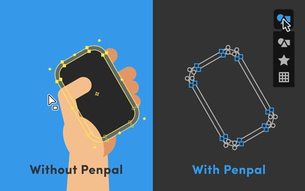
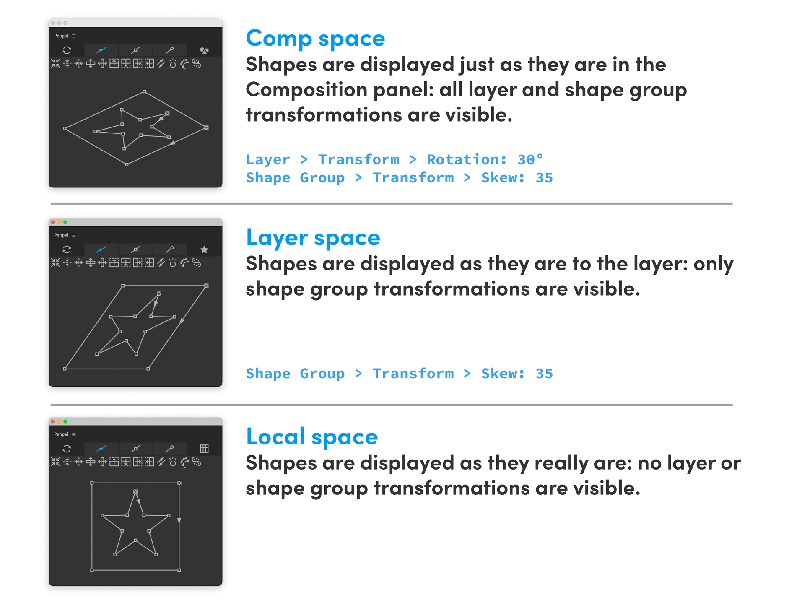
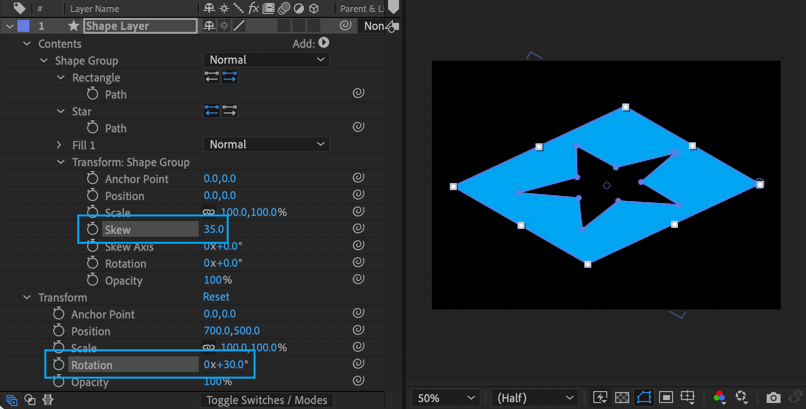

# Spaces

**Spaces** are ways of showing and editing your paths with or without the transformations that often affect their final appearance in After Effects. Let's say you have a rounded, rectanglular path, but the layer it is inside has been rotated. If you wanted to make the shape taller, it would be helpful to be able to edit the path without that rotation affecting things.

The **Spaces button** shows the active space. When you hover over it, a dropdown allows you to activate a different space.

 **Comp space** shows your paths as they appear in the composition panel in After Effects, with all the positioning, scaling, rotating, skewing, and other transformations that are affecting them.

 **Layer space** shows paths as if you were ‘inside’ the layer they are a part of. So if that layer is rotated, your space is rotated along with it, and the left side of the _layer_ will be shown in Penpal as the left side of the _canvas_.

 **Local space** shows paths as they 'really are', without **any** of the distortions that are applied to either their layer or any shape groups they are inside.

Many button operations behave differently depending on which Space you have active. For example if you [move points up](points-tab.md#move-up) in Comp space, they will move in the direction that is up in the composition panel. If your layer was rotated, and you moved them up _in Layer space_, they would move upwards _within the layer_, along it's angle of rotation.  [Flipping](path-tab.md#flip-vertically) and [centering](path-tab.md#center) Paths, [Aligning](points-tab.md#align-horizontal) and [distributing](points-tab.md#distribute-horizontally) points, [flattening](tangents-tab.md#flatten-vertically) and [flipping](tangents-tab.md#flip-horizontally) tangents, and even [snapping points to pixels](points-tab.md#snap)… all can behave differently if your path is inside a shape group or a layer that has been transformed.\
