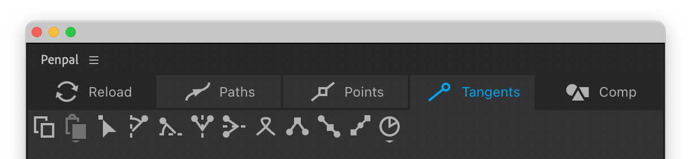

# Tangents tab


When dealing with tangents, remember that even a ‘zero’ tangent, is treated by Penpal as a selectable element. If you drag a marquee selection over a point with zero tangents, you’ll be selecting both tangents.


####  Copy

Copies the selected tangents. You can copy _one_ or _both_ tangents _of a pair_. You cannot copy tangents from different points.

####  Paste

Pastes the previously copied tangents, to selected tangents. You can paste to as many tangents as you like, simultaneously. If you copy and paste both In and Out tangents, they will paste in-to-in and out-to-out. However…

**If you copied both tangents from a pair, and paste to only one tangent of a pair**, which tangent is pasted will depend on which tangent you have _selected_. If you have the In tangent selected, Penpal will paste the copied In tangent. If you have the Out tangent selected, Penpal will paste the copied Out tangent.

**If you copied only one tangent from a pair, and paste to both tangents of a pair**, which tangent is altered depends on which tangent you _copied_. If you copied the In tangent, the selected In tangent will be pasted to. If you copied the Out tangent, the selected Out tangent will be pasted to.

**If you copied from only one tangent of a pair, and you paste to only one tangent of a pair**, you will paste the tangent you copied, regardless of In and Out status. In this way you can copy an Out tangent and paste to an In tangent.

####  Paste Length and  Paste Angle

If you hover over the Paste button, there are additional buttons to paste only the length or only the angle. If you paste length, the selected tangents will retain their existing angles. If you paste angle, the selected tangents will retain their existing length.

All three Paste buttons have a unique, super-local method of pasting that attempts to paste tangents relative to the angle of the neighbouring points. This mode is activated when you hold `Cmd/Ctrl` on clicking the Paste buttons. For example, if you make a many-sided polygon and then adjust the tangents of one point, copy them, and then paste to the other tangents holding `Cmd/Ctrl`, each pair of tangents will rotate the tangents to match the outer surface of the polygon.

Copying and pasting is not affected by changes to the Space. It's always performed within Local space, regardless of which Space you have active.

####  Zero

Zero’s out the selected tangents. You can also zero tangents by pressing the `Backspace` (delete) key on your keyboard in the Tangents tab.

####  Flatten to vertical axis

The selected tangents will be rotated, around their parent point, to the nearest spot on a vertical line running through that parent point. This line will be parallel to the Y axis of whichever [Space](spaces.md) is active. The tangent's length remains the same.

####  Flatten to horizontal axis

As above, but on a horizontal line.

####  Flip around vertical axis

This will rotate the selected tangents so that they flip over the vertical line running through their parent point. This line will be parallel to the Y axis of whichever [Space](spaces.md) is active.

####  Flip around horizontal axis

As above, but over a horizontal line.

####  Swap

This button swaps the tangents of a pair with one another. It functions the same regardless of whether you have one or both tangents selected.

####  Match length

Makes the selected tangents the same length as their opposite. If you only selected one tangent of a pair, it will adopt the length of the other, unselected one. If you select both tangents of a pair, both will be altered to an average.

####  Match angle

This button will rotate a selected tangent so that it is exactly 180º to it's opposite, and set the point to _smooth_ (the tangent handles are linked to one another to maintain a straight line as you drag them around). If you select both tangents of a pair, their angles will be averaged and then each one set to +90º and -90º away from this average.

#### &#x20; Align to point

This button will rotate a selected tangent so that it aligns directly toward it's neighbouring point. Eg. an In tangent will face toward the previous point and an Out tangent will face toward the next point.

####  Rotate

This button will rotate selected tangents by a value, specified in degrees, around their parent points. Holding the `Alt` key will make it rotate in the opposite direction. Hover over the button and click the gear icon to [Set Rotation value](tangents-tab.md#set-rotation-value).

####  Set Rotation value

This button sets a value, in degrees, which the [Rotate](tangents-tab.md#rotate) button applies.
